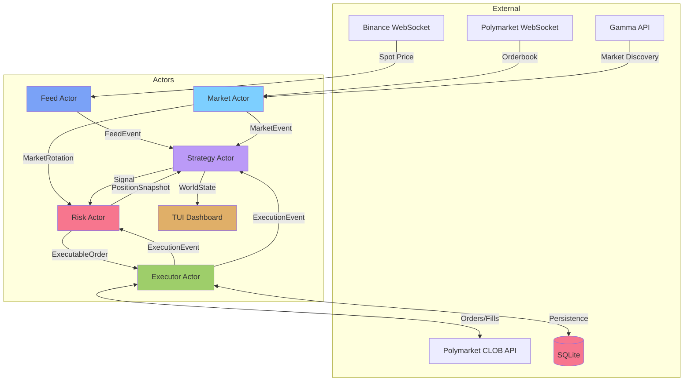

# Polymarket Trading Bot

A high-performance algorithmic trading bot for Polymarket prediction markets, built with Rust and Tokio. Features real-time data integration, dynamic market discovery, multiple alpha strategies, SQLite persistence, and comprehensive risk management.

## Features

### Core Capabilities

- **Real-Time Data Integration**
  - Binance WebSocket for spot price feeds (BTCUSDT)
  - Polymarket CLOB WebSocket for L2 orderbook streaming
  - Gamma API for automatic market discovery and rotation
  - WebSocket order tracking for real-time fills

- **Dynamic Market Discovery**
  - Multi-category support: Politics, Sports, Crypto, Finance, Geopolitics
  - Tag-based filtering and exclusion
  - Liquidity-based market filtering
  - Automatic rotation to nearest-expiry markets

- **Risk Management**
  - Fractional Kelly criterion for position sizing
  - Circuit breakers (daily loss limit, max positions)
  - Atomic kill switch for instant trading halt
  - Take-profit and stop-loss automation
  - Minimum order size enforcement ($1)

- **Alpha Strategies**
  - **Fair Value**: Black-Scholes binary option pricing
  - **Lead-Lag**: Momentum arbitrage between spot and prediction markets
  - **Flash Crash**: Mean-reversion on sudden price drops
  - **Book Imbalance**: Order-flow based entry signals
  - **Convergence**: Near-expiry probability convergence
  - **Market Maker**: Liquidity provision strategy
  - **NegRisk Arb**: Negative risk arbitrage

- **SQLite Persistence**
  - Trade history with PnL tracking
  - Open order state recovery
  - Position persistence across restarts
  - Strategy performance metrics
  - Migration system with version tracking

- **Terminal UI (TUI)**
  - Market search with category filtering
  - Float overlay filter menu
  - Multi-option market view
  - Strategy performance sparklines
  - Trade history panel
  - Real-time price updates
  - Keyboard-driven navigation

- **Robust Architecture**
  - Actor supervision with automatic restart
  - Graceful shutdown with order cancellation
  - WebSocket reconnection logic
  - Config hot-reload support

## Architecture



## Project Structure

```
polymarket-bot-rs/
├── src/
│   └── main.rs              # Entry point, actor orchestration
├── crates/
│   ├── pmbot-core/          # Shared types, config, messages
│   ├── pmbot-market/        # Market discovery, orderbook, WebSocket
│   ├── pmbot-feed/          # Binance price feeds, volatility
│   ├── pmbot-strategy/      # Trading strategies, world state
│   ├── pmbot-risk/          # Kelly sizing, limits, positions
│   ├── pmbot-executor/      # Order lifecycle, live/paper execution
│   ├── pmbot-db/            # SQLite persistence, migrations
│   └── pmbot-tui/           # Terminal UI with widgets
├── config/
│   └── default.yaml         # Default configuration
└── .env                     # Credentials (gitignored)
```

| Crate            | Responsibility                                    |
| ---------------- | -------------------------------------------------- |
| `pmbot-core`     | Shared types, messages, config, math utilities    |
| `pmbot-market`   | Market discovery, orderbook tracking, WebSocket   |
| `pmbot-feed`     | Binance price feeds, volatility computation       |
| `pmbot-strategy` | Signal generation, world state management          |
| `pmbot-risk`     | Kelly sizing, circuit breakers, position tracking |
| `pmbot-executor` | Order lifecycle, live/paper execution             |
| `pmbot-db`       | SQLite persistence, trade history, migrations      |
| `pmbot-tui`      | Real-time terminal dashboard with widgets          |

## Installation

### Prerequisites

- Rust 1.88+
- Polymarket account with USDC on Polygon

### Setup

1. Clone the repository:

```bash
git clone https://github.com/yourusername/polymarket-bot-rs.git
cd polymarket-bot-rs
```

2. Create `.env` file:

```bash
cp .env.example .env
```

3. Add your credentials to `.env`:

```env
PMBOT_PRIVATE_KEY=your_private_key_here
POLY_SAFE_ADDRESS=0xYourSafeAddress  # Optional for Gnosis Safe wallets
```

4. Configure `config/config.yaml` (copy from `config/default.yaml`):

```yaml
general:
  mode: paper  # or live
  strategies:
    - fair_value
    - lead_lag
  data_dir: ./data

risk:
  bankroll: 1000.0
  kelly_fraction: 0.15
  max_position_pct: 0.05
  max_positions: 5
  daily_loss_limit_pct: 0.05
  min_edge: 0.01
```

### Running

```bash
# Paper mode (simulation with real market data)
make run

# With TUI
make run-tui

# Live mode (real money)
make run-live

# View database
make db-view

# Kill switch
make kill    # Stop trading
make resume  # Resume trading
```

### Makefile Commands

| Command | Description |
|---------|-------------|
| `make build` | Build debug version |
| `make build-release` | Build optimized release |
| `make test` | Run tests |
| `make run` | Run in paper mode |
| `make run-tui` | Run with TUI interface |
| `make run-live` | Run in live mode (real money) |
| `make run-verbose` | Run with debug logging |
| `make db-view` | View SQLite database contents |
| `make db-setup` | Setup database directory |
| `make kill` | Activate kill switch |
| `make resume` | Deactivate kill switch |
| `make clippy` | Run linter |
| `make fmt` | Format code |

## Configuration Reference

### General Settings

| Setting | Type | Description |
|---------|------|-------------|
| `mode` | string | `paper` or `live` |
| `strategies` | array | List of active strategies |
| `data_dir` | path | Directory for SQLite database |

### Risk Settings

| Setting | Type | Default | Description |
|---------|------|---------|-------------|
| `bankroll` | float | 1000.0 | Starting capital (paper) or fetched from account (live) |
| `kelly_fraction` | float | 0.15 | Fraction of Kelly to use for sizing |
| `max_position_pct` | float | 0.05 | Max position as % of bankroll |
| `max_positions` | int | 5 | Maximum concurrent positions |
| `daily_loss_limit_pct` | float | 0.05 | Stop trading if daily loss exceeds this |
| `stop_loss_pct` | float | 0.30 | Stop-loss threshold |
| `take_profit_multiplier` | float | 2.0 | TP = entry + (edge × multiplier) |
| `min_edge` | float | 0.01 | Minimum edge to generate signal |

## TUI Keyboard Shortcuts

### Dashboard
| Key | Action |
|-----|--------|
| `/` | Open market search |
| `f` | Open filter menu |
| `q/Esc` | Quit |

### Market Search
| Key | Action |
|-----|--------|
| `Esc` | Return to dashboard |
| `/` | Focus search box |
| `↑/↓` | Navigate markets |
| `←/→` | Switch categories |

### Filter Menu
| Key | Action |
|-----|--------|
| `←/→` | Switch tabs |
| `↑/↓` | Navigate within tab |
| `Enter` | Select/Edit field |
| `Space` | Toggle strategy |
| `a` | Apply filters |
| `Esc` | Back to dashboard |
| `d` | Remove last tag |

## Database Schema

### Tables

- **trades**: Trade history with PnL
- **open_orders**: Active order state
- **positions**: Current positions
- **strategy_metrics**: Performance by strategy
- **app_state**: Application state (migrations, last run)

## Development

### Building

```bash
cargo build --release
```

### Testing

```bash
cargo test --workspace
```

### Running with Logging

```bash
RUST_LOG=debug cargo run --release -- run --paper
```

## Recent Changes

### v2.0.0

- **YAML Configuration**: Migrated from TOML to YAML for better readability
- **SQLite Persistence**: Added database for trade history and state recovery
- **Multi-Category Discovery**: Markets can be filtered by category (Politics, Sports, etc.)
- **Multi-Option Support**: Architecture supports N-outcome markets
- **TUI Improvements**:
  - Float overlay filter menu
  - Market search with real-time filtering
  - Category tabs for navigation
  - Single-line keyboard shortcuts
- **Bug Fixes**:
  - Partial fill double-counting fix
  - Reconciler integration on startup
  - Config watcher hot-reload
  - Kill switch atomic check (no I/O on every signal)
- **Architecture**:
  - Actor supervision with restart
  - Graceful shutdown
  - WebSocket reconnection logic

## License

MIT License - See [LICENSE](LICENSE) for details.

## Disclaimer

This software is provided for educational and research purposes only. Trading in prediction markets involves significant risk of capital loss. The authors are not responsible for any financial losses incurred through the use of this bot. Always test thoroughly in paper mode before deploying live capital.