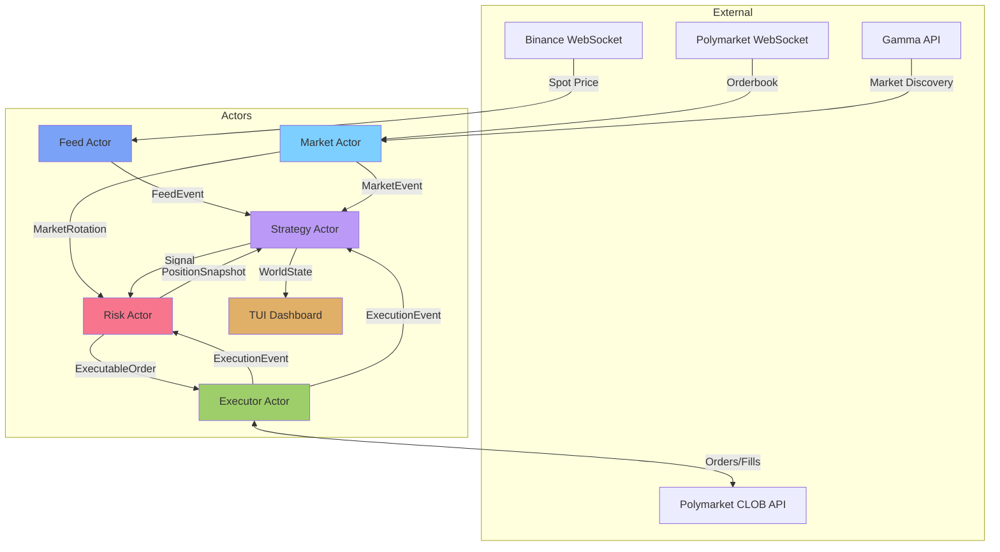
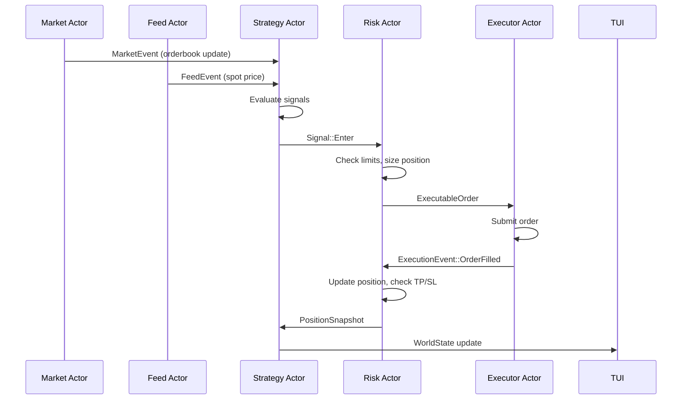
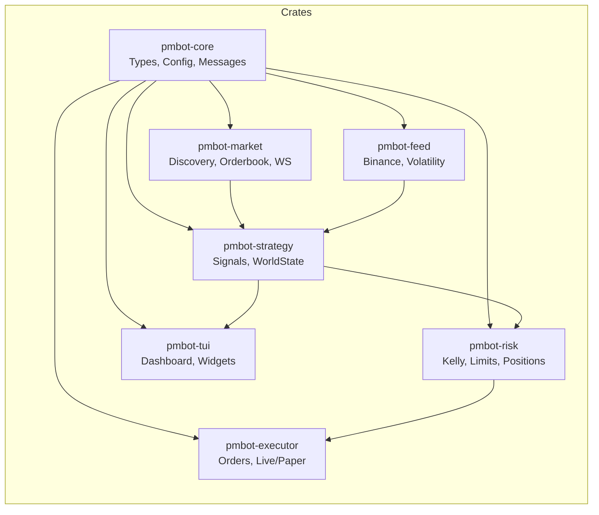
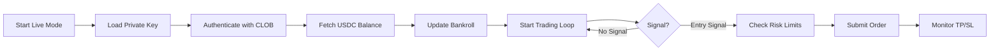

# Polymarket Trading Bot

A high-performance algorithmic trading bot for Polymarket prediction markets, built with Rust and Tokio. Features real-time data integration, dynamic market discovery, multiple alpha strategies, and comprehensive risk management.

## Features

### Core Capabilities

- **Real-Time Data Integration**
  - Binance WebSocket for spot price feeds (BTCUSDT)
  - Polymarket CLOB WebSocket for L2 orderbook streaming
  - Gamma API for automatic market discovery and rotation

- **Dynamic Market Rotation**
  - Automatically selects markets nearest to expiry
  - No-trade zones to prevent late entries
  - Seamless transition between expiring and new markets

- **Risk Management**
  - Fractional Kelly criterion for position sizing
  - Circuit breakers (daily loss limit, max positions)
  - Take-profit and stop-loss automation
  - Minimum order size enforcement ($1)

- **Alpha Strategies**
  - **Fair Value**: Black-Scholes binary option pricing
  - **Lead-Lag**: Momentum arbitrage between spot and prediction markets
  - **Flash Crash**: Mean-reversion on sudden price drops
  - **Book Imbalance**: Order-flow based entry signals
  - **Convergence**: Near-expiry probability convergence
  - **Market Maker**: Liquidity provision strategy

- **Execution**
  - Paper mode for simulation with real market data
  - Live mode with Polymarket SDK integration
  - Automatic USDC balance fetching for live accounts
  - Rate-limited API calls

- **Terminal UI (TUI)**
  - Tokyo Night color theme
  - Real-time orderbook visualization
  - Position tracking with TP/SL display
  - Strategy performance metrics (trades, win rate, PnL)
  - Market info with expiry countdown
  - Auto-logging of position changes

## Architecture



## Data Flow



## Project Structure



| Crate            | Responsibility                                    |
| ---------------- | ------------------------------------------------- |
| `pmbot-core`     | Shared types, messages, config, math utilities    |
| `pmbot-market`   | Market discovery, orderbook tracking, WebSocket   |
| `pmbot-feed`     | Binance price feeds, volatility computation       |
| `pmbot-strategy` | Signal generation, world state management         |
| `pmbot-risk`     | Kelly sizing, circuit breakers, position tracking |
| `pmbot-executor` | Order lifecycle, Live/Paper execution             |
| `pmbot-tui`      | Real-time terminal dashboard                      |

## Installation

### Prerequisites

- Rust 1.88+
- Polymarket account with USDC on Polygon

### Setup

1. Clone the repository:

```bash
git clone https://github.com/yourusername/polymarket-bot-rs.git
cd polymarket-bot-rs
```

2. Create `.env` file:

```bash
cp .env.example .env
```

3. Add your credentials to `.env`:

```env
PMBOT_PRIVATE_KEY=your_private_key_here
POLY_SAFE_ADDRESS=0xYourSafeAddress  # Optional for Gnosis Safe wallets
```

4. Configure `config/default.toml`:

```toml
[general]
mode = "paper"  # or "live"
strategies = ["fair_value", "lead_lag"]

[risk]
bankroll = 1000.0              # Configurable; live mode fetches actual balance
kelly_fraction = 0.15
max_position_pct = 0.05
max_positions = 5
daily_loss_limit_pct = 0.05
min_edge = 0.01                # Minimum 1% edge to trade
```

### Running

```bash
# Paper mode (simulation with real market data)
cargo run --release run --config config/default.toml --paper --tui

# Live mode (real money)
cargo run --release run --config config/default.toml --live --tui
```

## Configuration Reference

### General Settings

| Setting      | Type   | Description                                              |
| ------------ | ------ | -------------------------------------------------------- |
| `mode`       | string | `"paper"` or `"live"`                                    |
| `log_level`  | string | Log verbosity: `trace`, `debug`, `info`, `warn`, `error` |
| `strategies` | array  | List of active strategies                                |

### Risk Settings

| Setting                  | Type  | Default | Description                                             |
| ------------------------ | ----- | ------- | ------------------------------------------------------- |
| `bankroll`               | float | 1000.0  | Starting capital (paper) or fetched from account (live) |
| `kelly_fraction`         | float | 0.15    | Fraction of Kelly to use for sizing                     |
| `max_position_pct`       | float | 0.05    | Max position as % of bankroll                           |
| `max_positions`          | int   | 5       | Maximum concurrent positions                            |
| `daily_loss_limit_pct`   | float | 0.05    | Stop trading if daily loss exceeds this                 |
| `stop_loss_pct`          | float | 0.30    | Stop-loss threshold                                     |
| `take_profit_multiplier` | float | 2.0     | TP = entry + (edge × multiplier)                        |
| `min_edge`               | float | 0.01    | Minimum edge to generate signal                         |

### Strategy Settings

Each strategy has its own section:

```toml
[strategy.fair_value]
enabled = true
vol_multiplier = 1.0
min_time_to_expiry_secs = 120
min_activation_edge = 0.01

[strategy.lead_lag]
enabled = true
lag_threshold = 0.005
entry_delay_ms = 500
exit_convergence_pct = 0.002
```

## Strategies

### Fair Value

Computes theoretical binary option prices using Black-Scholes:

- Uses BTC realized volatility from Binance
- Calculates probability of BTC > strike at expiry
- Enters when market price deviates from fair value by > `min_activation_edge`

### Lead-Lag

Momentum strategy based on BTC spot price movement:

- Monitors BTC price changes over configurable window
- Enters when BTC moves > `lag_threshold`
- Direction matches expected market reaction

### Flash Crash

Mean-reversion on sudden price drops:

- Monitors for rapid price declines > `drop_threshold`
- Enters long when price stabilizes
- Exits on recovery to `reversion_target`

### Book Imbalance

High-frequency signal based on orderbook liquidity:

- Calculates imbalance ratio from bid/ask sizes
- Enters when imbalance > `threshold` with momentum confirmation
- Exits on imbalance reversal

## Risk Management

### Position Sizing

Uses fractional Kelly criterion:

```rust
position_size = f_star * kelly_fraction * bankroll
position_size = min(position_size, max_position_pct * bankroll)
position_size = max(position_size, $1)  // Minimum order
```

### Take Profit / Stop Loss

- TP calculated from entry price and edge
- SL set to `stop_loss_pct` below entry
- Automatically monitored and triggered by Risk Actor

### Circuit Breaker

- Halts trading if daily loss > `daily_loss_limit_pct`
- Respects `kill_switch_path` file for manual stop
- Enforces `max_positions` limit

## Live Mode

When running in live mode:

1. Bot authenticates with Polymarket using your private key
2. Fetches actual USDC balance from your account
3. Places real orders on Polymarket CLOB
4. All risk limits apply



## Development

### Building

```bash
cargo build --release
```

### Testing

```bash
cargo test --workspace
```

### Code Structure

```
polymarket-bot-rs/
├── src/
│   └── main.rs              # Entry point, actor orchestration
├── crates/
│   ├── pmbot-core/          # Shared types and config
│   ├── pmbot-market/        # Market discovery and orderbook
│   ├── pmbot-feed/          # External price feeds
│   ├── pmbot-strategy/      # Trading strategies
│   ├── pmbot-risk/          # Risk management
│   ├── pmbot-executor/      # Order execution
│   └── pmbot-tui/           # Terminal UI
├── config/
│   └── default.toml        # Default configuration
└── .env                    # Credentials (gitignored)
```

## License

MIT License - See [LICENSE](LICENSE) for details.

## Disclaimer

This software is provided for educational and research purposes only. Trading in prediction markets involves significant risk of capital loss. The authors are not responsible for any financial losses incurred through the use of this bot. Always test thoroughly in paper mode before deploying live capital.
