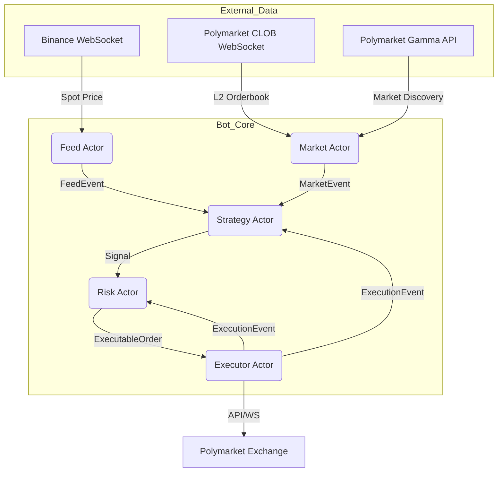

# Polymarket Trading Bot (RS)

A high-performance, production-ready algorithmic trading bot for Polymarket prediction markets, built with Rust and Tokio.

## Overview

`polymarket-bot-rs` is an actor-based trading system designed for low-latency execution and robust risk management. It integrates real-time data from Binance and Polymarket CLOB to identify and execute on mispriced opportunities in binary options markets.

## Architecture

The bot uses a concurrent **Actor-based architecture** where each component runs in its own task and communicates via asynchronous message passing.



## Key Features

- **Real-Time Data Integration**: 
    - **Binance WebSocket**: High-speed spot price feeds for reference assets (e.g., BTCUSDT).
    - **Polymarket CLOB WebSocket**: Direct L2 orderbook streaming for active markets.
- **Dynamic Market Discovery**: Automatically rotates through the most liquid markets using the Gamma API.
- **Robust Risk Engine**:
    - **Kelly Criterion**: Automated position sizing based on calculated edge and confidence.
    - **Circuit Breaker**: Automatic halt on daily loss limits or system anomalies.
    - **No-Trade Zone**: Prevents entering positions too close to market expiry.
- **Alpha Strategies**:
    - **Fair Value**: Black-Scholes based binary option pricing.
    - **Lead-Lag**: Exploits latency between spot and prediction markets.
    - **Orderbook Imbalance**: High-frequency signals based on liquidity pressure.
- **Reliability**: 
    - **Reconciler**: Syncs local state with exchange state on startup.
    - **Graceful Shutdown**: Ensures no orphaned orders are left on the exchange.
    - **Paper Trading**: Fully functional simulation mode using real-time market data.

## Project Structure

| Crate | Responsibility |
|-------|----------------|
| `pmbot-core` | Shared types, messaging, math (decimal_sqrt), and config loading. |
| `pmbot-market` | Orderbook tracking, market discovery (Gamma), and WebSocket consumer. |
| `pmbot-feed` | External price feeds (Binance) and realized volatility computation. |
| `pmbot-strategy` | Signal generation logic and world state management. |
| `pmbot-risk` | Kelly sizing, portfolio limits, and circuit breakers. |
| `pmbot-executor` | Order lifecycle management and exchange interaction (Live/Paper). |
| `pmbot-tui` | Real-time terminal dashboard for monitoring PnL and status. |

## Setup

1. **Environment Variables**:
   Copy `.env.example` to `.env` and fill in your credentials:
   ```bash
   PMBOT_PRIVATE_KEY=your_private_key_here
   POLY_SAFE_ADDRESS=optional_gnosis_safe_address
   ```

2. **Configuration**:
   Modify `config/default.toml` to set your bankroll, risk limits, and active strategies.

3. **Running**:
   ```bash
   # Run in Paper Mode (Simulation)
   make run-paper STRATEGIES=fair_value,lead_lag

   # Run in Live Mode
   make run-live STRATEGIES=fair_value
   ```

## Disclaimer

This software is for educational and research purposes only. Trading in prediction markets involves significant risk of capital loss. The authors are not responsible for any financial losses incurred through the use of this bot.
